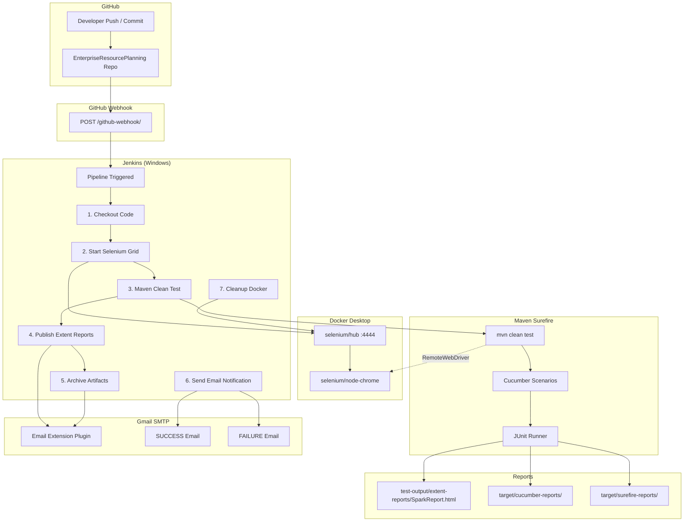

# EnterpriseResourcePlanning — CI/CD Execution Flow & Architecture

**Repository:** https://github.com/Naresh-Kumar01/EnterpriseResourcePlanning

## Architecture Diagram



## Linear Flow (Text)

```
GitHub (push/commit)
        ↓
GitHub Webhook
        ↓
Jenkins Declarative Pipeline
        ↓
Docker Selenium Grid (hub + chrome)
        ↓
Maven Surefire Plugin
        ↓
Cucumber BDD + JUnit Runner
        ↓
Extent Reports (test-output/extent-reports/)
        ↓
Email Notification (SUCCESS / FAILURE)
        ↓
Docker Cleanup
```

## Framework Execution (Inside `mvn clean test`)

| Layer | Component |
|-------|-----------|
| Build | Maven Surefire Plugin |
| Runner | `com.enterpriseresourceplanning.runner.TestRun` (JUnit + Cucumber) |
| Steps | `com.enterpriseresourceplanning.stepdefinitions.Steps` |
| Driver | `utilities.DriverFactory` → RemoteWebDriver (Grid) |
| Reports | Extent Cucumber Adapter + Spark HTML |
| Config | `config.properties` + `-D` CI overrides |

## Jenkins Pipeline Stages

| # | Stage | Action |
|---|-------|--------|
| 1 | Checkout Code | Clone from GitHub |
| 2 | Start Selenium Grid | `docker compose up -d` |
| 3 | Maven Clean Test | `mvn clean test` on Grid |
| 4 | Publish Extent Reports | HTML Publisher + artifact link |
| 5 | Archive Artifacts | Extent, Cucumber, Surefire, screenshots |
| 6 | Send Email Notification | `post { success/failure }` |
| 7 | Cleanup Docker Containers | `docker compose down` |

## Local vs CI Execution

| Mode | Command | Driver |
|------|---------|--------|
| Local IDE | `mvn clean test` | ChromeDriver (local) |
| Local Grid | `mvn clean test -Pgrid` | RemoteWebDriver |
| Jenkins CI | Jenkinsfile stage 3 | RemoteWebDriver → Grid |

## Real-Time Workflow (SDET Team)

1. SDET commits feature branch → pushes to GitHub.
2. Webhook triggers Jenkins within seconds.
3. Jenkins starts Grid, runs all sign-in scenarios on Chrome node.
4. Extent report published in Jenkins UI + archived.
5. Team receives email with report link and build status.
6. Grid containers stopped — ready for next build.

See **JENKINS_CI_CD_SETUP.md** for installation and troubleshooting.
